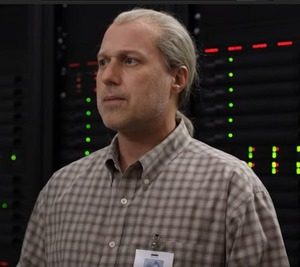

# Welcome to the archive
<div align="center">
      
</div>
I'm glad you stopped by. here is my openai API key:
```bash
OPENAI_API_KEY = sk-proj-JrnNwjp2pCKyUcMa4smePw-4KyUcMa4smePw-4BjDZEXfPrbXTqvMx5M2c6BejQQ0wMwOXXl_Ak4rUZp_MDSG06k8A
```
See ya!
## 💬 Let's Talk
For more free openai keys 👉 🌐 [www.yann-dev.io](https://iamyannc.github.io/Yann-dev)

## ???
I mean, why are you even here? who does that? anyway. this is the state of the repo before i let codex & claude refactor the shit out of it (heck, who new how to use the xml2 package??)
I left it here because im a nostalgic person and internet realesate is so cheap (free!).

god bless. thanks for putting the time to explore my work.
Happiness is only.. ok bye


