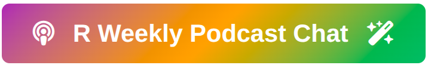

# R Weekly Podcast Scraper 🙃 🚴
<div align="center">
  <a href="https://jokasan.github.io/r-weekly_chatbot/" target="_blank">
    
  </a>
</div>

I first started this project before agents and LLMs wrote code for us. I had to, god forbid, copy-paste regex and css selectors like in the old days... <br>

**What is it anyway?**
An automated project aimed to provide an easy-to-use database with all the goodies from the folks at the [R Weekly Highlights](https://serve.podhome.fm/r-weekly-highlights) podcast. <br>
Full episodes breakthrough: **Description, shownotes and full transcripts** (where available) of each episode.

**What can it become?** Whatever you make of it!

---
## 🚀 How to Use

### Quick Start: Just Read the Data

**1. Clone the repository**
```bash
git clone https://github.com/iamYannC/r-podcast.git
cd r-podcast
```

**2. Load and explore**
```r
# Load the most recent snapshot

# There might be more than one snapshot at a time, ensure you scrape the latest.

files <- list.files("outputs/snapshots", pattern = "^snapshot_.*\\.rds$", full.names = TRUE)
latest <- files[which.max(file.mtime(files))]
snapshot <- readRDS(latest)

```

**That's it!**

---

### Development Workflow

Want to rebuild the database yourself? fine:

**Option A: Rebuild from existing binaries** *(recommended - fast!)*
```r
source("build_all.R")
build_all()  # uses use_existing = TRUE by default
```

**Option B: Scrape everything from scratch**
```r
source("build_all.R")
build_all(use_existing = FALSE)
```

**Check for new episodes**
```r
source("cicd/fetch-new-episode.R")
# Automatically fetches only new episodes and updates the database
```
---
## 🎉 Shout Out!

Imagine my surprise to see that someone forked my repo, and it wasnt even by accident!

[Nils Indreiten](https://github.com/Jokasan/r-weekly_chatbot) built a cool AI chatbot based on (or inspired by) the previous version of this scraping project. Go check it out (but don't burn his api credits...) 👇


<div align="center">
  <a href="https://jokasan.github.io/r-weekly_chatbot/" target="_blank">
    
  </a>
</div>


---

## 📂 Project Structure

[Read more here](assets/technical-details.md)

## ⚠️ Non-Affiliation

This project is **not affiliated with or endorsed by the R Weekly team**. 
This is an independent, fun project to make podcast data more accessible. and because before LLMs it was real good practice of web-scraping! (it stil is, but differnet...)

I encourage everyone to:
- **Use, Tweak, Copy & Build** Whatever comes to mind. just let me know about it.
And if you find this useful, give it a star ⭐ - my mom will be proud!

---

## 💬 Let's Talk
All contact details 👉 🌐 [www.yann-dev.io](https://iamyannc.github.io/Yann-dev)
