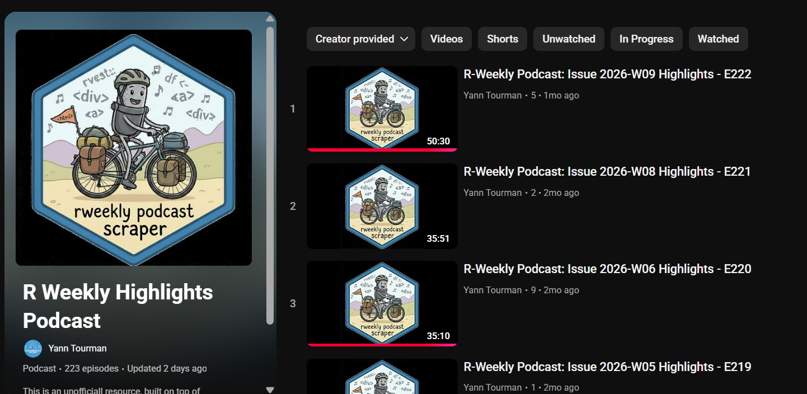

# R Weekly Podcast Scraper 🙃 🚴
<div align="center">
  <a href="https://jokasan.github.io/r-weekly_chatbot/" target="_blank">
    
  </a>
</div>

I first started this project before agents and LLMs wrote code for us. I had to, god forbid, copy-paste regex and css selectors like in the old days... <br>

**What is it anyway?**
An automated project aimed to provide an easy-to-use database with all the goodies from the folks at the [R Weekly Highlights](https://serve.podhome.fm/r-weekly-highlights) podcast. <br>
Full episodes breakthrough: **Description, shownotes and full transcripts** (where available) of each episode.

## YouTube Playlist! 
This project allowed me to upload the ENTIRE R WEEKLY PODCAST to YouTube & YouTube music!
Every time a new episode is fetched, I pull the newest snapshot and upload the episode to a [YouTube playlist](https://www.youtube.com/playlist?list=PLxKyQJfLuxYAQRfm8XFqbLbm18EzBNzz6)

<a href="https://www.youtube.com/playlist?list=PLxKyQJfLuxYAQRfm8XFqbLbm18EzBNzz6">
  
</a>

---
## Show me the data 📊
### R Users
```r
repo <- "https://github.com/iamYannC/r-podcast/raw/main/outputs"

# R Binary (RDS)
snapshot <- paste0(repo, "/snapshots/snapshot_latest.rds") |>
  url() |> readRDS()

closeAllConnections()


# SQLite Database
sqlite_url <- paste0(repo, "/exports/snapshot_sqlite.sqlite")
sqlite_file <- tempfile(fileext = ".sqlite")

download.file(sqlite_url, sqlite_file, mode = "wb")
con <- DBI::dbConnect(RSQLite::SQLite(), sqlite_file)
snapshot <- lapply(DBI::dbListTables(con),\(tb) DBI::dbReadTable(con, tb))
DBI::dbDisconnect(con) 

```

### Python Users
```python
# pip install pandas openpyxl
from pathlib import Path
from sqlite3 import connect
from urllib.request import urlretrieve
import pandas as pd

repo = "https://github.com/iamYannC/r-podcast/raw/main/outputs"

meta_xlsx = pd.read_excel(f"{repo}/exports/snapshot_xlsx.xlsx", sheet_name="meta")

sqlite_path = Path("snapshot_sqlite.sqlite")
urlretrieve(f"{repo}/exports/snapshot_sqlite.sqlite", sqlite_path)

with connect(sqlite_path) as con:
    pass # The World Is Yours
```
### Regular people
Just download the [xlsx workbook](https://github.com/iamYannC/r-podcast/raw/main/outputs/exports/snapshot_xlsx.xlsx).

find your preferred file type in `outputs/snapshots` (`.rds`) or `outputs/exports` (SQLite and xlsx).

## 🎉 Shout Out!

Imagine my surprise to see that someone forked my repo, and it wasnt even by accident!

[Nils Indreiten](https://github.com/Jokasan/r-weekly_chatbot) built a cool AI chatbot based on (or inspired by) the previous version of this scraping project. Go check it out (but don't burn his api credits...) 👇


<div align="center">
  <a href="https://jokasan.github.io/r-weekly_chatbot/" target="_blank">
    
  </a>
</div>


---

## 📂 Project Structure

[Read more here](assets/technical-details.md)

## ⚠️ Non-Affiliation

This project is **not affiliated with or endorsed by the R Weekly team**. 
This is an independent, fun project to make podcast data more accessible. and because before LLMs it was real good practice of web-scraping! (it stil is, but differnet...)

I encourage everyone to:
- **Use, Tweak, Copy & Build** Whatever comes to mind. just let me know about it.
And if you find this useful, give it a star ⭐ - my mom will be proud!

---

## 💬 Let's Talk
All contact details 👉 🌐 [www.yann-dev.io](https://iamyannc.github.io/Yann-dev)
