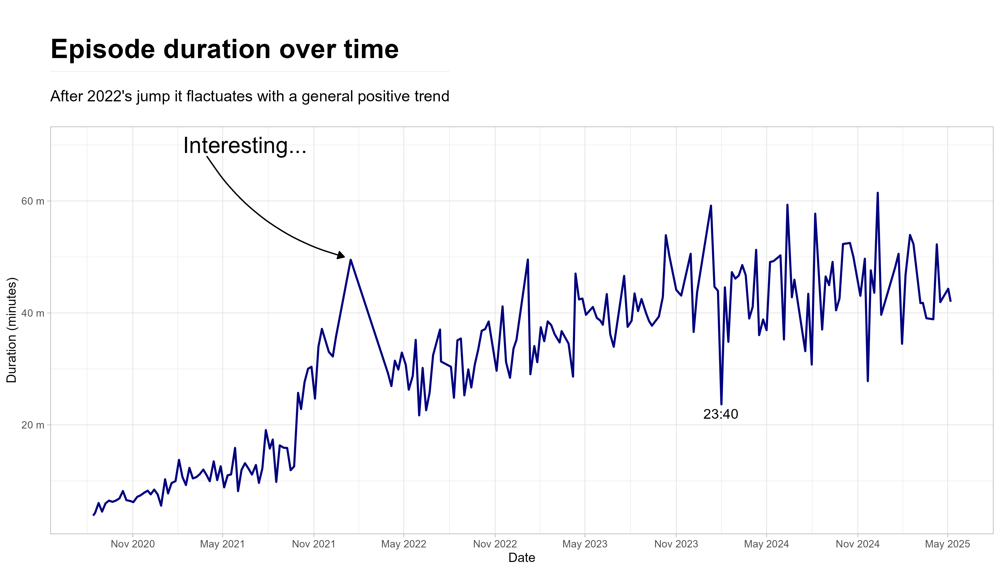

# Welcome!

Author: Yann Cohen

## What is it all about?

A Fun Mini-Project: Scraping the R-Weekly Highlight Podcast This educational and open-source project involves scraping the R-Weekly highlight podcast. Users are encouraged to maintain ethical standards when accessing the information. If you find anything interesting, feel free to submit a PR or contact me! 😊

### NOT a memeber...

Please note that I am not an official member of the R-Weekly team. Everything you find here is unrelated to the podcast/weekly highlights team.

### What you will find here

-   \`r_weekly_podcast_scrape.R\` - the main script where all the scraping happens.

-   \`r_weekly_podcast_scra[e_followup.R\` - a few simple follow-up analysis i have conducted. it's subject to changes and you are most welcome to get inspired and do new things!

-   `auto_workflow.R` - this is just the activation file that is ran by `auto workflow.yml`.

-   `data.json`, `data.rds` and `data.xlsx` with all the information regarding each episode:

    -   episode duration

    -   short & long description

    -   transcript (when available)

    -   chapters

    -   links

Source - [R Weekly Highlights](https://serve.podhome.fm/r-weekly-highlights)

[Contact me](mailto:Yannco5@gmail.com)

 Note the tabs—each corresponds to a different part of the episode and can be easily joined via the primary key `ep_name` (episode name).
